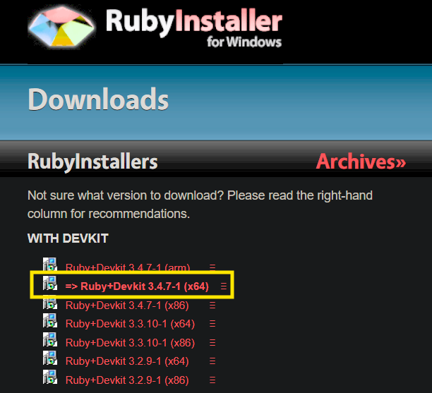

Imagina que quieres publicar un libro. Tú eres el escritor, pero no sabes cómo encuadernar las páginas, diseñar la portada o imprimirlo.

## Que es? 

Jekyll es como tu imprenta automática personal.

Tú solo te preocupas por escribir el texto (el contenido), y Jekyll se encarga automáticamente de todo el trabajo "sucio" (diseño, estructura y código) para entregarte un sitio web terminado.

En terminos tecnicos, es un generador de sitios estáticos (SSG - Static Site Generator). Es una herramienta que toma texto simple y lo transforma en un sitio web completo y listo para publicar.


## Instalacion

Antes, es necesario realizar la instalacion de Ruby y sus dependencias

### Proceso de Instalacion de Ruby

Descargar el instalador de Ruby + DEVKIT



```console
"Para saber defender, hay que saber atacar"
```
Es decir, conocer la perspectiva del atacante, para luego empezar a reducir las alternativas que tiene al intentar vulnerar algun sistema y en consecuencia aplicar una defensa.

```console
Nos vemos en la consola!!!😎
```


[def]: ./captures/jekyll1.png